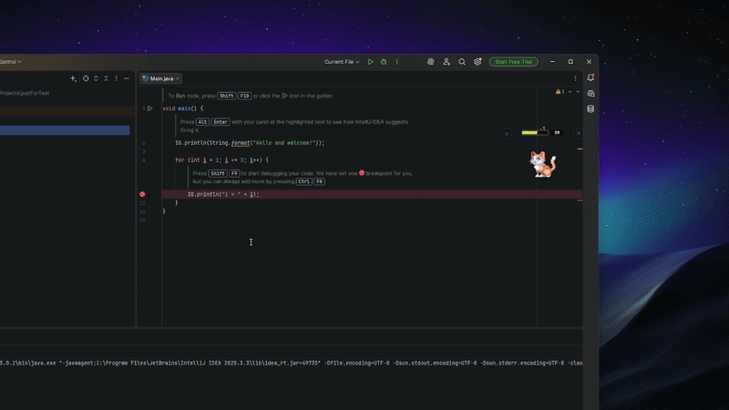
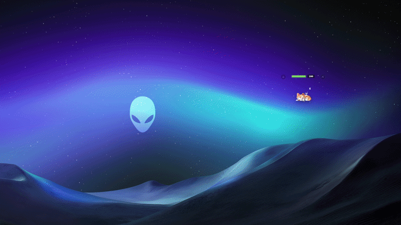

# Committen 🐱

> **You commit, she eats. You don't, she starves.**

`Committen` = `commit` + `kitten`. A pixel cat who lives on your desktop and eats your `git commit`s. When you slack off into apps that aren't on your work whitelist, she pounces and minimizes them. When you don't code, she goes hungry. You don't want her to be hungry.

<table align="center">
  <tr>
    <td align="center" width="50%">
      
      <br>
      <sub><b>🍱 You <code>git commit</code> → she eats → +30 hunger</b></sub>
    </td>
    <td align="center" width="50%">
      
      <br>
      <sub><b>😾 You slack off → she pounces → the window is minimized</b></sub>
    </td>
  </tr>
</table>

> **Status:** `v0.1.0` shipped. [Download the Windows installer →](https://github.com/hhhxxxjjj/Committen/releases/latest)
>
> ⚠️ Note: the v0.1.0 release was published under the previous name **FocusCat** before we renamed to Committen. Functionally identical; v0.1.1 (coming) will rebrand the installer.

---

## Why she exists

Most focus tools work through **punishment** — they block sites, kill apps, lock you out. You hate them and try to bypass them. They're a war between you and your tool.

Committen works through **symbiosis**:

- She's already there on your screen, watching. You like having her around.
- Every `git commit` feeds her +30 hunger.
- Hunger ticks down 1/min naturally. Switching to non-work apps costs her another 10.
- At hunger 100 she sleeps. Below 50 she paces around your desktop looking for food. Below 20 her bar pulses red — she's starving.
- You don't want her to starve. **That pull is stronger than any blocker.**

It's the difference between *"I'm being punished for slacking"* and *"my cat is hungry because I'm slacking."* The doc behind this design (in this repo's history) went through 5 iterations to land on this mechanic.

---

## What she does

| Trigger | Reaction |
|---------|----------|
| `git commit` in a watched repo | **Hunger +30**, plays `eat` animation, green `+30` popup |
| Switch to a non-whitelist app | She pounces (`attack` animation), **minimizes the window**, **−10 hunger** |
| Time passes (every minute) | Hunger −1 |
| Hunger reaches 100 | She curls up and **sleeps** 💤 |
| Hunger drops below 50 | She **paces around your desktop** looking for food |
| Hunger drops below 20 | Bar turns red and pulses |

The cat is a transparent always-on-top window. Drag her anywhere. Hover for `⌂` (reset position) and `✕` (quit) controls. Position persists across restarts.

---

## Install

### The easy way — Windows installer

[**Download the latest .exe →**](https://github.com/hhhxxxjjj/Committen/releases/latest)

Double-click to install. Find Committen in the Start Menu. Done.

> ⚠️ Windows SmartScreen will warn that the app is from an "unknown publisher" — this is normal for any unsigned independent project. Click **More info → Run anyway** to proceed. You can audit the source in this repo first if you want.

### The hacker way — run from source

Requires Node.js 18+ on Windows.

```bash
git clone https://github.com/hhhxxxjjj/Committen.git
cd Committen
npm install
npm start          # production-ish run
npm run dev        # opens DevTools alongside, useful for finding process names
```

Run from source if you want to **edit the whitelist or watch a custom git repo** — see Configuration below.

---

## Configuration

**Easy way (v0.1.2+):** Hover over the cat → click the **⚙ button** → `config.json` opens in your default editor. Edit, save, restart Committen. Done.

The config file lives at `%APPDATA%\committen\config.json` on Windows. On first launch, it's auto-created from a sensible default template.

### Whitelist

Apps in the whitelist are "work" — she ignores them. Match by display name (`"Claude"`, `"Windows Explorer"`) or executable filename (`"Code.exe"`, `"chrome.exe"`).

To find what to whitelist for a given app, run `npm run dev`, switch to the offending app, and look at the terminal log:

```
[Committen] ATTACK name="WhateverApp" path="C:\...\app.exe" title="..." hwnd=...
```

Add `"WhateverApp"` (the `name` value) to your `whitelist` array, restart, done.

### Git monitor

Set `gitRepo` to a repo path she should watch:

```json
"gitRepo": "D:\\path\\to\\your\\repo"
```

She tails `.git/logs/HEAD`. Every commit (made anywhere — IDE, terminal, GitHub Desktop) gives her +30.

### Real minimize vs. animation-only

Default: `monitor.actuallyMinimize: false` — she plays the attack animation but doesn't actually minimize the window. This is a safety setting so you can verify your whitelist before letting her loose.

When you trust the whitelist, flip it:

```json
"monitor": { "actuallyMinimize": true }
```

Restart, and she'll start actually minimizing distraction windows.

### Passive mode (for demos / streaming / screen recording)

Recording your screen and don't want the cat to pounce on your recording software? Flip:

```json
"monitor": { "passive": true }
```

She'll still play her hunger / idle / sleep animations and react to your `git commit`s, but she **won't attack** anything. Restart to apply, flip back when you're done recording.

---

## How she works

```
Committen (Electron)
├── Main process
│   ├── WindowMonitor   — polls active-win every 1s, fires onIntruder if not whitelisted
│   ├── GitWatcher      — fs.watchFile on .git/logs/HEAD, parses commit lines
│   ├── HungerSystem    — 0–100 EventEmitter, persisted to userData/state.json
│   ├── minimize.js     — calls PowerShell + User32.ShowWindow (no native modules)
│   └── orchestration   — wires events to sprite state + hunger updates via IPC
└── Renderer (transparent always-on-top window)
    ├── Sprite state machine (idle / walk / sleep / attack / eat)
    ├── Hunger bar UI (color shift + pulse when low)
    └── Native drag region with hover-revealed controls
```

**No native modules to compile.** The "native" part is calling `powershell.exe` to invoke `User32.ShowWindow` for actual window minimization. Runs on stock Windows, no Visual Studio Build Tools required.

---

## Roadmap

| Version | Goal | Status |
|---------|------|--------|
| `v0.1.0` | First public release: cat + sprite states + hunger + window monitor + git watcher | ✅ Released as FocusCat |
| `v0.1.1` | Rename to Committen + README rebuild | ✅ |
| `v0.1.2` | Config in `userData/` for post-install editing; ⚙ open-config button; passive mode for screen recording | ✅ |
| `v0.2`   | Smarter UWP whitelist; HURT / JUMP states; address top user-feedback items | ⏳ |
| later    | macOS port, custom sprite packs, statistics view | 💭 |

v0.2 priorities will be driven by real user feedback from v0.1.x — file an issue if something hits you.

---

## Credits

Pixel cat sprites by the artist of *Cat 2D Pixel Art* (paid full pack). See [`CREDITS.md`](CREDITS.md) and `src/assets/SPRITE_LICENSE.txt` for license terms — the sprites are usable in projects (personal/commercial) but **not** redistributable as game assets and **not** NFT-able.

---

## License

[`MIT`](LICENSE) for source code. Sprite art has its own license (see above). Don't extract and republish the sprites separately.

---

## Etymology

`commit` (the act of finalizing your code into git) + `kitten` (your accomplice on the desktop).

She lives on your commits. Feed her well.
